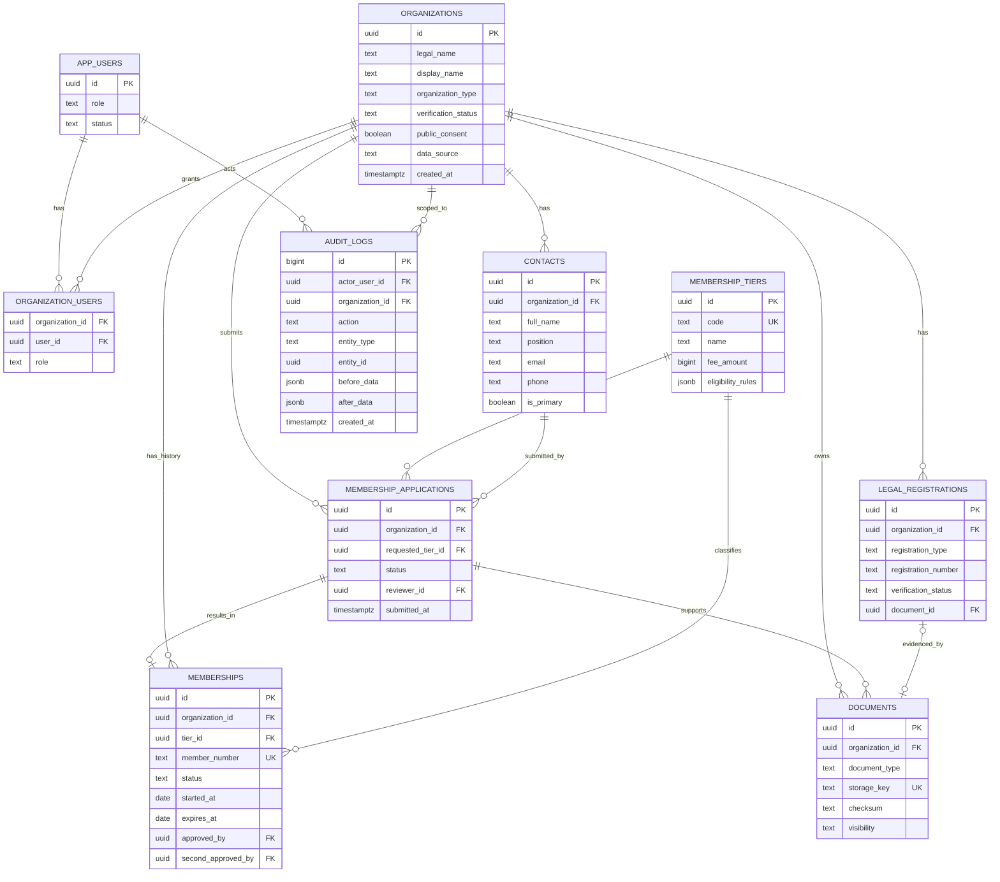
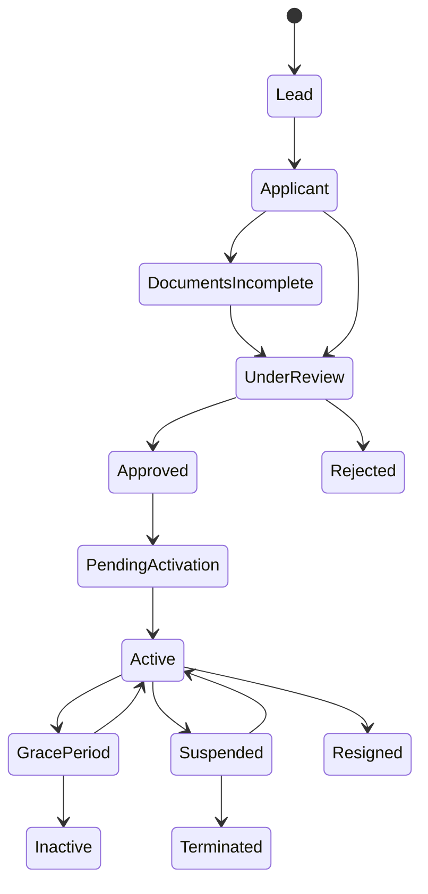

# ERD — FWP Member Registry



## Ownership

- `organizations`: identitas canonical lembaga.
- `contacts`: orang dan riwayat jabatan lembaga.
- `legal_registrations`: legalitas per jenis izin.
- `membership_applications`: proses pengajuan/review.
- `memberships`: status keanggotaan resmi dan historinya.
- `membership_tiers`: aturan tier versioned.
- `documents`: metadata file privat/publik.
- `audit_logs`: jejak perubahan append-only.

## Lifecycle



## Boundary Publik

Direktori publik membaca view terkontrol, bukan tabel mentah:

```text
organization.verification_status = verified
AND membership.status = active
AND organization.public_consent = true
```

Tidak diekspos: kontak pribadi, dokumen, catatan reviewer, pembayaran, nilai aset rinci, audit log.
