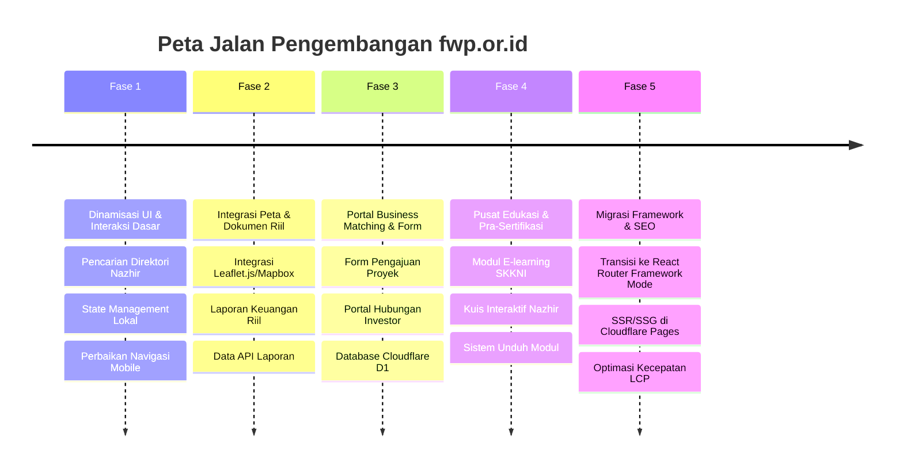

# Analisis & Roadmap Proyek: fwp.or.id

Dokumen ini menyajikan analisis arsitektur, desain, fungsionalitas, serta peta jalan (roadmap) pengembangan berkelanjutan untuk portal resmi **Forum Wakaf Produktif (FWP)**.

---

## 1. Analisis Proyek Saat Ini (Current State Analysis)

### 1.1. Tech Stack & Dependensi
Berdasarkan pemeriksaan file konfigurasi [package.json](file:///Users/ridloabelian/Github/fwp.or.id/package.json) dan [AGENTS.md](file:///Users/ridloabelian/Github/fwp.or.id/AGENTS.md), proyek ini menggunakan teknologi modern berikut:
- **React 19 & Vite 8**: Menawarkan performa pengembangan yang sangat cepat dan runtime rendering yang efisien.
- **React Router v7 (Client-Side)**: Digunakan untuk navigasi antar halaman (*multi-page transitions*) tanpa reload halaman secara penuh.
- **Framer Motion**: Digunakan untuk animasi transisi (*fade-in*, *scale*, *stagger*) yang halus dan premium.
- **Recharts**: Digunakan untuk visualisasi tren pengumpulan wakaf uang nasional.
- **Lucide React**: Kumpulan ikon SVG konsisten untuk seluruh UI.
- **Vanilla CSS3**: Styling menggunakan variabel CSS kustom (*CSS tokens*) di [index.css](file:///Users/ridloabelian/Github/fwp.or.id/src/index.css), menghindari ketergantungan pada TailwindCSS sesuai aturan proyek.
- **Cloudflare Pages**: Direncanakan sebagai platform hosting serverless yang cepat dan andal.

### 1.2. Arsitektur Kode & Halaman
Struktur kode diatur dengan rapi di dalam direktori `src/`:
- **[App.jsx](file:///Users/ridloabelian/Github/fwp.or.id/src/App.jsx)**: Menampung perutean utama dan komponen penunjang global seperti `<Navbar />`, `<ScrollToTop />`, dan `<Footer />`.
- **Halaman yang Tersedia (`src/pages/`)**:
  1. **[HomePage.jsx](file:///Users/ridloabelian/Github/fwp.or.id/src/pages/HomePage.jsx)**: Halaman depan interaktif dengan Counter Stats, grafik batang pencapaian wakaf (Recharts), dan elemen animasi melayang berbasis HTML5/CSS-motion.
  2. **[AboutPage.jsx](file:///Users/ridloabelian/Github/fwp.or.id/src/pages/AboutPage.jsx)**: Menampilkan profil FWP, visi misi, struktur organisasi, dan sejarah pembentukan.
  3. **[ProgramsPage.jsx](file:///Users/ridloabelian/Github/fwp.or.id/src/pages/ProgramsPage.jsx)**: Menguraikan program strategis FWP (advokasi, inkubasi bisnis, sertifikasi).
  4. **[NazhirCenterPage.jsx](file:///Users/ridloabelian/Github/fwp.or.id/src/pages/NazhirCenterPage.jsx)**: Pusat standar kompetensi (SKKNI & Waqf Core Principles) dilengkapi daftar direktori Nazhir.
  5. **[SuccessStoriesPage.jsx](file:///Users/ridloabelian/Github/fwp.or.id/src/pages/SuccessStoriesPage.jsx)**: Studi kasus proyek wakaf produktif yang sukses (misal: RS Hasyim Asy'ari, properti produktif).
  6. **[BusinessMatchingPage.jsx](file:///Users/ridloabelian/Github/fwp.or.id/src/pages/BusinessMatchingPage.jsx)**: Portal perantara antara Lembaga Nazhir pemilik proyek dan korporasi/investor sosial.
  7. **[TransparencyPage.jsx](file:///Users/ridloabelian/Github/fwp.or.id/src/pages/TransparencyPage.jsx)**: Laporan audit keuangan tahunan, direktori regulasi/fatwa, dan peta geospasial wakaf nasional.

### 1.3. Kualitas Desain & Estetika
Aplikasi memiliki nilai visual yang sangat tinggi:
- **Glassmorphism**: Penggunaan latar belakang semi-transparan dengan efek blur (`backdrop-filter`) untuk kartu info memberikan kesan modern dan premium.
- **Design System Berbasis Token**: CSS kustom menggunakan palet warna korporat yang harmonis (Navy `#132c3f`, Green `#8bc53f`, Cyan `#16aeca`).
- **Mikro-Animasi**: Efek hover yang responsif pada tombol dan kartu, serta transisi loading halaman yang dinamis.

---

## 2. Analisis Kesenjangan & Peluang (Gaps & Opportunities)

Meskipun fondasi UI sudah sangat baik, beberapa bagian aplikasi masih bersifat statis (*mocked*). Berikut adalah area utama yang memerlukan peningkatan untuk menjadikannya portal tingkat produksi:

1. **Integrasi Data Dinamis (API)**:
   - Data statistik di halaman beranda (misal: *Luas Tanah Wakaf*, *SDM Nazhir*) dan grafik pencapaian Recharts saat ini ditulis secara statis (*hardcoded*). Perlu dihubungkan ke API database nasional (misalnya dari Kementerian Agama atau BWI).
2. **Peta Geospasial Interaktif**:
   - Peta sebaran tanah wakaf di halaman transparansi saat ini berupa placeholder berupa garis putus-putus. Ini harus diintegrasikan dengan pustaka peta seperti **Mapbox GL JS** atau **Leaflet.js** untuk menampilkan lokasi fisik proyek wakaf secara real-time.
3. **Pencarian Direktori Nazhir Real-time**:
   - Input pencarian direktori Nazhir pada halaman `NazhirCenterPage` belum memfilter data secara aktif. Perlu ditambahkan state local React atau *search parameter routing* untuk menyaring daftar Nazhir.
4. **Portal Business Matching Interaktif**:
   - Form pengajuan proposal wakaf oleh Nazhir dan formulir penawaran investasi dari investor masih bersifat mock/desain statis. Fitur ini membutuhkan database relasional (seperti **Cloudflare D1**) dan API backend untuk menyimpan dan mencocokkan data proyek.
5. **E-Learning SKKNI & Sertifikasi**:
   - Tombol pendaftaran sertifikasi dan akses e-learning mengarah ke halaman kosong atau eksternal. Perlu dikembangkan modul kuis pra-sertifikasi terintegrasi untuk menambah nilai guna bagi para Nazhir.
6. **Optimasi SEO & Rendering**:
   - Wakaf merupakan gerakan sosial berskala nasional yang sangat bergantung pada pencarian organik (SEO). Karena saat ini menggunakan SPA (*Single Page Application* dengan `BrowserRouter`), mesin pencari mungkin kesulitan merayapi konten yang dinamis. Migrasi ke mode *Static Site Generation* (SSG) atau *Server-Side Rendering* (SSR) dengan React Router v7 Framework Mode akan sangat menguntungkan.

---

## 3. Peta Jalan Pengembangan (Roadmap)



### Fase 1: Dinamisasi UI & Interaksi Dasar (Minggu 1-2)
- **Target**: Meningkatkan fungsionalitas komponen UI yang sudah ada tanpa memerlukan perubahan backend besar.
- **Tugas**:
  - Implementasikan logika pencarian real-time di halaman **Pusat Nazhir** ([NazhirCenterPage.jsx](file:///Users/ridloabelian/Github/fwp.or.id/src/pages/NazhirCenterPage.jsx)) menggunakan filtering array lokal React.
  - Sempurnakan menu navigasi mobile agar memiliki animasi slide-in yang halus menggunakan Framer Motion.
  - Tambahkan state loading dan skeleton loader saat berganti halaman.

### Fase 2: Integrasi Peta & Laporan Riil (Minggu 3-4)
- **Target**: Mengaktifkan visualisasi geospasial dan dokumen akuntabilitas resmi.
- **Tugas**:
  - Pasang **Leaflet.js** (ringan dan tanpa lisensi berbayar) di halaman **Transparansi** ([TransparencyPage.jsx](file:///Users/ridloabelian/Github/fwp.or.id/src/pages/TransparencyPage.jsx)) untuk menggantikan placeholder peta.
  - Hubungkan peta tersebut dengan file JSON eksternal berisi data geografis proyek wakaf produktif (RS, Sekolah, Kebun, dll).
  - Hubungkan tombol unduh laporan dengan file PDF laporan keuangan tahunan riil (simpan di Cloudflare R2 atau direktori `/public`).

### Fase 3: Portal Business Matching & Form Interaktif (Minggu 5-6)
- **Target**: Membangun interaksi dua arah antara Nazhir (pengelola) dan Investor (pemilik modal).
- **Tugas**:
  - Buat form pengajuan proposal proyek di halaman **Layanan Bisnis** ([BusinessMatchingPage.jsx](file:///Users/ridloabelian/Github/fwp.or.id/src/pages/BusinessMatchingPage.jsx)).
  - Implementasikan validasi form sisi klien dan pengiriman data ke email admin atau penyimpanan database sementara (menggunakan Cloudflare Pages Functions).
  - Tampilkan daftar proposal proyek yang aktif dengan fitur filter berdasarkan sektor (Pertanian, Kesehatan, Properti).

### Fase 4: Pusat Edukasi & Pra-Sertifikasi Nazhir (Minggu 7-8)
- **Target**: Menyediakan materi pembelajaran SKKNI yang berharga bagi Nazhir baru.
- **Tugas**:
  - Buat antarmuka e-learning sederhana yang menampilkan silabus 37 unit kompetensi SKKNI.
  - Kembangkan fitur kuis pilihan ganda interaktif di halaman **Pusat Nazhir** untuk menguji pemahaman tata kelola syariah dan hukum wakaf.
  - Integrasikan sistem download modul PDF pembelajaran secara gratis setelah pengguna mengisi form data diri singkat.

### Fase 5: Migrasi Framework & Optimasi SEO (Minggu 9+)
- **Target**: Memaksimalkan kecepatan akses (Core Web Vitals) dan perayapan mesin pencari (SEO).
- **Tugas**:
  - Migrasikan perutean client-side dari `react-router-dom` ke konfigurasi **React Router v7 Framework Mode** (menggunakan routing berbasis file/config dan prerendering).
  - Terapkan Static Site Generation (SSG) pada halaman statis seperti *Tentang Kami* dan *Program* agar langsung dimuat dalam milidetik di Cloudflare Pages.
  - Lakukan audit performa LCP (Largest Contentful Paint) dan pastikan kompresi gambar (menggunakan format WebP) berjalan dengan baik.

---

## 4. Cara Berkontribusi & Menjalankan Pengembangan

Setiap pengembang yang ingin melanjutkan pengerjaan proyek ini wajib mengikuti langkah-langkah berikut:

1. **Instalasi Dependensi**:
   ```bash
   npm install
   ```
2. **Menjalankan Server Pengembangan Lokal**:
   ```bash
   npm run dev
   ```
3. **Melakukan Linting Kode** (Menjaga kebersihan dan kepatuhan standar React):
   ```bash
   npm run lint
   ```
4. **Membangun Proyek untuk Produksi**:
   ```bash
   npm run build
   ```
   *Catatan: File hasil build di folder `dist/` siap dideploy langsung ke Cloudflare Pages.*

---
*Dokumen ini dibuat secara otomatis oleh Antigravity AI Code Assistant untuk memandu tim pengembangan Forum Wakaf Produktif.*
